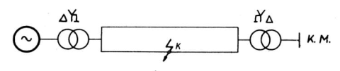

Metoda "korak po korak" za proračun dinamičke stabilnosti.

Numerički proračun dinamičke stabilnosti jednostavnog EES-a pomoću tzv. metode korak po korak (varijanta Eulerove metode). Razmatra se nastup bilo koje vrste kratkog spoja (K3, K2, K2Z, K1) na jednom od dva paralelna voda kojim je elektrana (tj. generator i blok transformator) priključena na ostatak elektroenergetskog sustava. Moguće je pritom razmatrati djelovanje automatskog ponovnog uklopa (tropolni APU) kojim se isključuje vod u kvaru a koji može biti uspješan ili pak neuspješan.

Literatura: M. i K. Ožegović, ELEKTRIČNE MREŽE III, Sveučilište u Splitu, FESB, Split, 1982.
